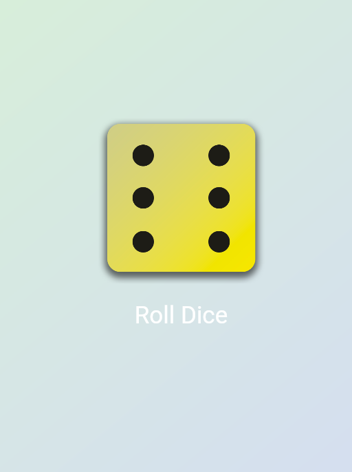

# Flutter Dice Roller App

A simple Flutter application that simulates rolling a dice. The app features a gradient background and interactive dice images that change when the user presses a button.

## Features

- Roll a dice with a single tap.
- Random dice value from 1 to 6.
- Gradient background for a modern look.
- Animated state management using 'StatefulWidget'.

## Getting Started

This project is a starting point for a Flutter application.

A few resources to get you started if this is your first Flutter project:

- [Lab: Write your first Flutter app](https://docs.flutter.dev/get-started/codelab)
- [Cookbook: Useful Flutter samples](https://docs.flutter.dev/cookbook)

For help getting started with Flutter development, view the
[online documentation](https://docs.flutter.dev/), which offers tutorials,
samples, guidance on mobile development, and a full API reference.

### Prerequisites

- [Flutter SDK](https://flutter.dev/docs/get-started/install)
- A device or emulator to run the Flutter app

## Project Structure

main.dart
Entry point of the app that initializes the GradientContainer.

gradient_container.dart
A reusable widget that creates a gradient background and centers the DiceRoller.

dice_roller.dart
Contains the dice rolling logic and UI, including the dice image and roll button.

styled_text.dart
A reusable text widget with predefined styles.

assets/images/
Folder containing dice images named dice-1.png to dice-6.png.

class1.dart
Placeholder widget for additional future features.

##  Customization

Change the gradient colors in main.dart by updating the colors list.

Replace dice images in assets/images/ to customize visuals.

Modify text styles in styled_text.dart for different appearances.

## Screenshots
